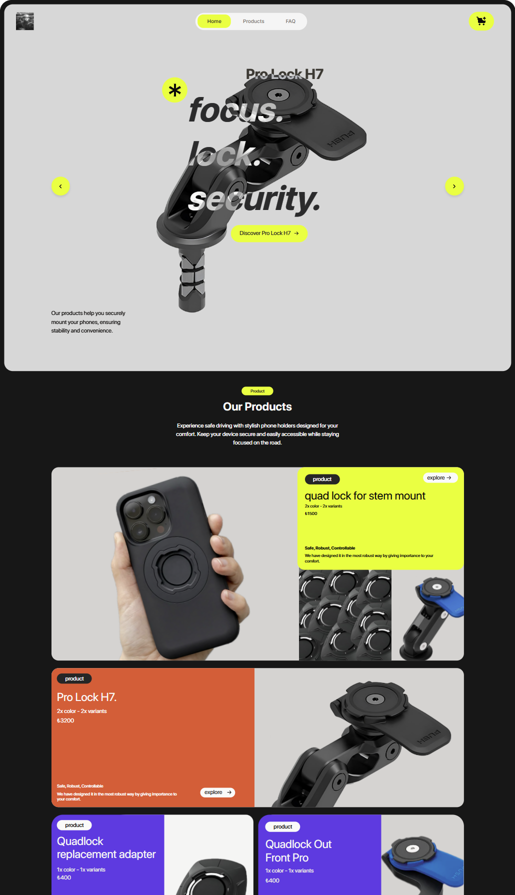
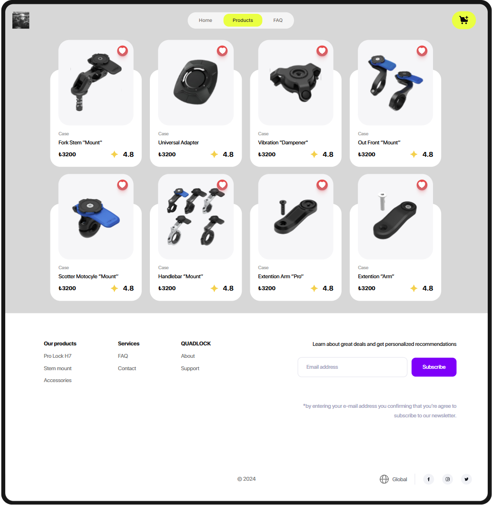
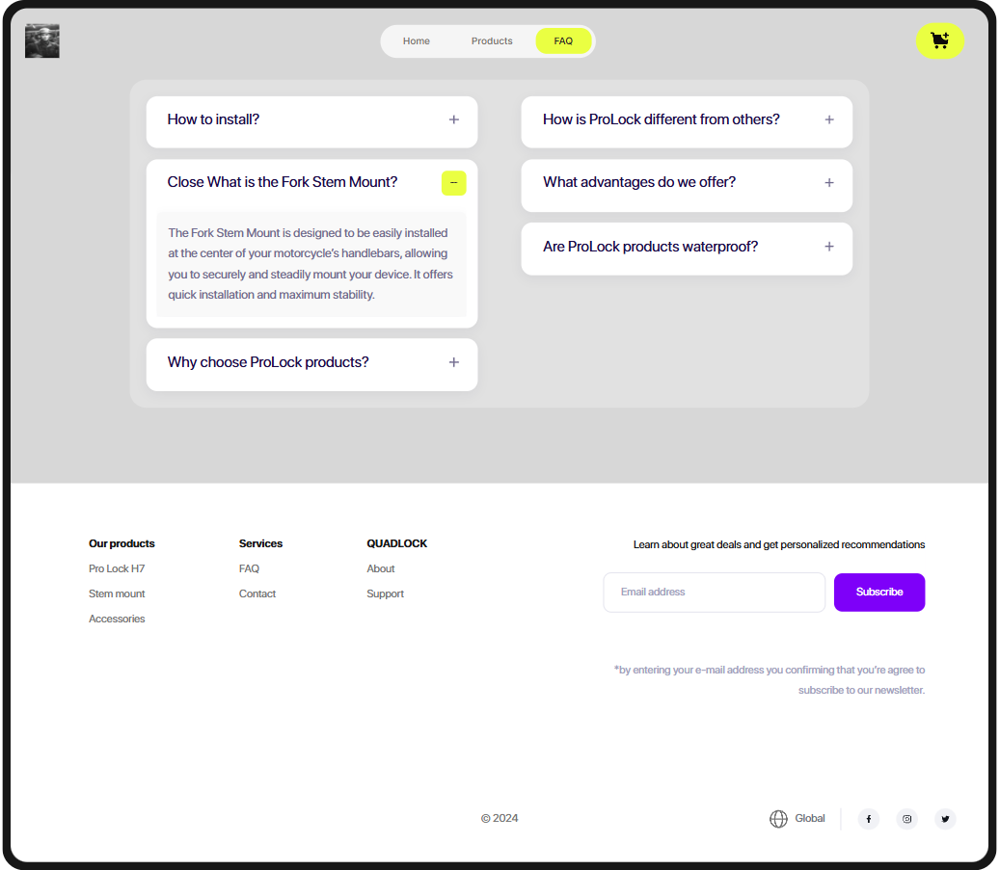

# Prolock Ecommerce 🎁

**Prolock Ecommerce** is a modern e-commerce platform designed to help users easily browse, discover, and purchase products. This project prioritizes user experience and aesthetic design to create a seamless shopping experience.

---

## 🖥️ Key Features

- **Landing Page**: A visually appealing homepage to showcase your brand and products.
- **Product Listing Page**: Displays all available products with a clean and modern layout.
- **Product Detail Page**: Provides detailed information about a single product, including features and price.
- **FAQ Page**: Answers common user questions to enhance the shopping experience.

---

## 🚀 Technologies Used

- **React**: For building the user interface.
- **Tailwind CSS**: For fast and customizable styling.
- **Redux**: For state management.
- **JavaScript**: For interactive functionality.

---

## 📸 Screenshots

### 1. Landing Page
Showcase your brand and products:

### 2. Product Listing Page
Display all products in a modern grid layout:

### 3. Product Detail Page
Detailed view of a single product:

### 4. FAQ Page
Answers to frequently asked questions:

---
